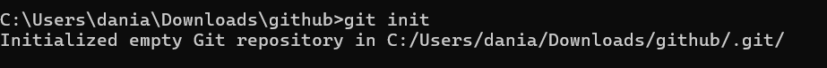
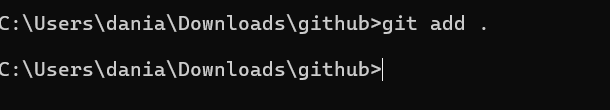
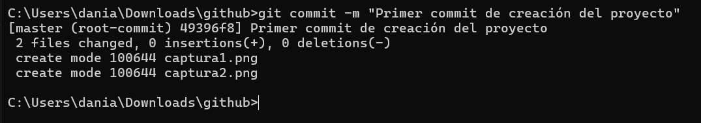
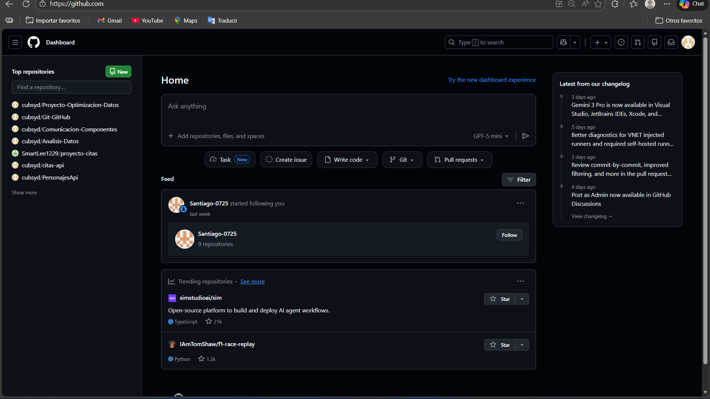
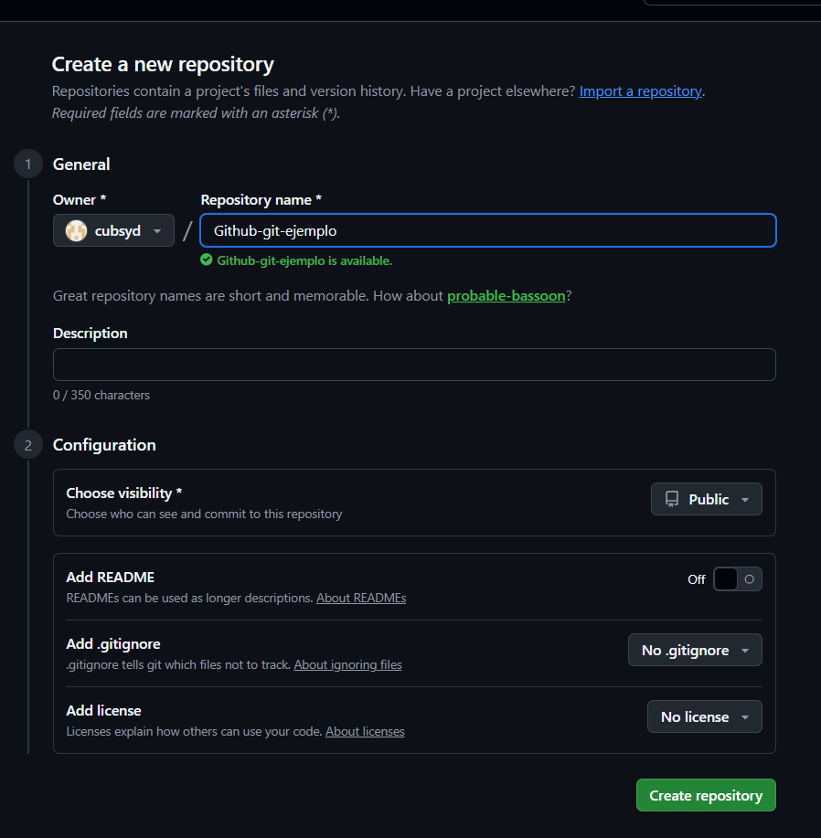
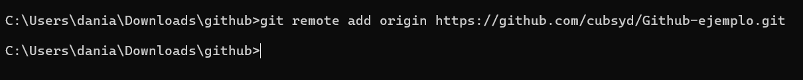

# Informe sobre Git y GitHub

Este informe documenta el proceso completo para crear, configurar y subir un repositorio a GitHub utilizando Git desde la terminal. A continuación se explican los principales comandos utilizados y se evidencian las etapas con capturas de pantalla.

---

## Comandos principales de Git

- `git init`: Inicializa un repositorio Git en la carpeta actual.
- `git add .`: Agrega todos los archivos al área de preparación (staging).
- `git commit -m "mensaje"`: Crea un commit con los archivos preparados.
- `git remote add origin <URL>`: Conecta el repositorio local con uno remoto en GitHub.
- `git push -u origin main`: Envía los commits al repositorio remoto en la rama `main`.

---

## Proceso paso a paso

### 1. Creación del archivo README.md

1. **Inicializa el repositorio local**
   Ejecuta `git init` en la carpeta de tu proyecto.
   

   ---

2. **Agrega los archivos al área de preparación**
   Usa `git add .` para incluir todos los archivos o `git add nombre_archivo` para uno específico.
   

   ---

3. **Confirma los cambios**
   Ejecuta `git commit -m "Descripción de los cambios"` para guardar el estado actual.
   

   ---

4. **Conecta tu repositorio local con GitHub**
   Usa `git remote add origin https://github.com/tu_usuario/tu_repositorio.git`.
   

   ---

5. **Sube los cambios al repositorio remoto**
   Ejecuta `git push -u origin main` (o `master`, según tu configuración).
   

   ---

6. **Verifica en GitHub**
   Abre tu repositorio en GitHub y asegúrate de que los archivos estén visibles.
   

   ---
